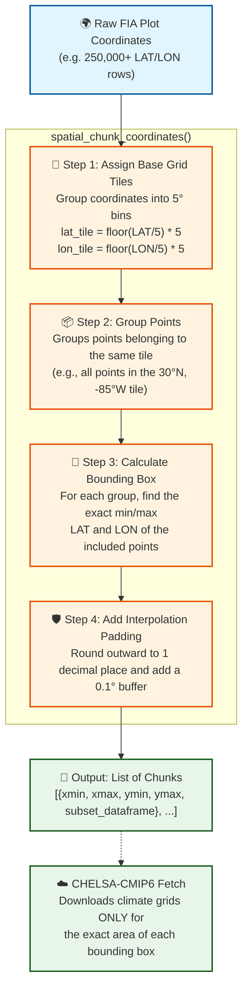

# Training the MATRIX Model

This directory handles the data preparation and training pipelines for the Matrix Model's global forest demography Random Forests. 

## Training Data Requirements

To successfully train the demographic components (Upgrowth, Mortality, and Recruitment), your dataset must meet the following structural and environmental requirements:

### 1. Plot-Level Longitudinal Data
The model relies on repeat measurements of individual trees over time.
- **`PrevYR` & `YR` (or `dY`):** The initial and subsequent measurement years to calculate the time interval between surveys.
- **`PrevDBH` & `DBH`:** The diameter at breast height (in cm) of the tree at both time periods.
- **`Status` / `M`:** A flag indicating whether the tree died between measurements.
- **`TPH` (Trees Per Hectare):** The expansion factor or weight of the sampled tree to calculate stand-level metrics like basal area (`B`) and density (`N`).
- **`R` (Recruitment):** New trees that grew past the minimum DBH threshold (e.g., 10 cm) between measurements must be identifiable.

### 2. Spatial Cross-matching
Every plot must have accurate **Latitude** and **Longitude** (`LAT` / `LON`) coordinates to intersect with global gridded spatial covariates. 

### 3. Required Covariates
The Random Forest models predict demography using approximately 40 environmental drivers. The pipeline extracts these using spatial data, but if you provide a pre-processed dataset, it must contain:
- **Bioclimate (`C1`-`C21`):** 19 standard BioClim variables, plus Annual Aridity Index (AI) and Potential Evapotranspiration (PET).
- **Soil Properties (`O1`-`O5`):** Bulk density, Total Nitrogen, C/N ratio, pH in water, and Electrical conductivity.
- **Anthropogenic Impacts (`H1`-`H4`):** Human footprint (current and historical changes), roadless area proximity, and protected area status.
- **Topography (`T1`-`T12`):** Slope, aspect, curvature, Topographic Position Index (TPI), and terrain roughness.
- **Ecoregions (`GEZ` & `CONTINENT`):** Global Ecological Zones and Continent labels to one-hot encode regional fixed effects.

### Warnings & Edge Cases
- **Missing Covariates:** The training pipeline uses a spatial nearest-neighbor algorithm (`replace_rows_with_nearest`) to impute missing environmental data.
- **Short Time Intervals:** Measurement intervals (`dY`) that are too short (1-2 years) may hide true diameter increment (`dD`) behind measurement error, reducing Upgrowth $R^2$.
- **Class Imbalance:** Mortality is a rare event. Heavy disturbance tracking requires careful stratification.

---
## Base Data Preparation (`prepare_data.py`)
Extracts `ENTIRE_PLOT` and `ENTIRE_TREE` into a base longitudinal table (`fia_matrix_training_base`) by grouping observations where `REMPER` is not null. 

> [!NOTE] 
> **On Plot Connectivity & Spatial Fuzzing** 
> The USFS FIA strictly anonymizes exact geographic plot coordinates by up to 1 mile and swaps 20% of private land plots. As a result, relying strictly on `LAT` and `LON` for time-series continuity can incorrectly pair distinct, overlapping survey grids. To ensure exact eternal tracking of a physical plot location, `prepare_data.py` natively imports the `STATECD`, `UNITCD`, `COUNTYCD`, and `PLOT` composite variables as a permanent geographic identifier. (A plot's individual *survey visits* are strictly keyed by the timestamped `CN` Control Number, which we've explicitly mapped as `PlotID` for matrix prediction generation).

---
## Section 1: Leveraging Precomputed Grid3km Data

If you have access to the pre-computed `grid_3km` BigQuery dataset containing the environmental drivers (`C1`-`C21`, `T1`-`T12`, `O1`-`O5`, `H1`-`H4`), you can use the spatial mapper to instantly bind forest plots to their nearest grid cell covariates. This is the fastest and recommended approach for model iteration.

### Spatial Grid Mapping (`grid3km_covariates.py`)

To efficiently connect historical forest plots to pre-computed global environmental arrays without creating explosive Cartesian dependencies, we use the standalone `grid3km_covariates.py` spatial mapper. 

#### Implementation Details
*   **Dimensionality Reduction:** The script executes a strict `SELECT DISTINCT` isolating only the permanent physical coordinates (`STATECD, UNITCD, COUNTYCD, PLOT, LAT, LON`) from the base longitudinal tree data (`fia_matrix_training_base`). This completely drops the millions of individual `PlotID` (temporal visit) rows and bounds trees down to single locations.
*   **S2 Geographic Joins:** It merges those distinct plot geometries with the pre-populated `grid_3km` BigQuery dataset (containing fields like `C1`-`C21`, `T1`-`T12`) using an S2 bounded geographic query: `ST_DWithin(plot, grid, 10000)`. This searches within 10 km to overcome USFS coordinate blurring rules.
*   **Nearest Neighbor Matrix:** The algorithm enforces a rigorous `QUALIFY ROW_NUMBER() = 1` partition ordered by `ST_DISTANCE`, ensuring that every physical plot merges precisely once against its closest logical grid cell. The script calculates and stores this difference natively as `Distance_Meters`.
*   **Preserved Keys:** To satisfy downstream `.RData` `randomForest` predictors, the pipeline accurately outputs the fixed plot coordinate strings tightly as exactly `LAT` and `LON`, alongside all 38 Ecoregion one-hot dummy variables (`GEZ_label*`), but cleanly drops all overlapping dynamic demographics (like `N`, `dY`, and `DBH1`-`DBH13`).

#### How to Run
```bash
uv run python Covariate/grid3km_covariates.py --execute
```
*This generates `cameltrain.Forest_MATRIX.fia_grid3km_covariates`, a pristine, statically bound table ready to instantly match covariates back to active plots via their exact `STATECD, UNITCD, COUNTYCD, PLOT` keys.*

---
## Section 2: Constructing a Custom Covariate Dataset

If you are expanding the model to a new geographic area, requiring new variables, or cannot access the precomputed `grid_3km` dataset, you must manually gather and process the data from various remote sources. The following pipelines detail how to extract, process, and combine data from multiple global environmental arrays to construct your own coordinate-bound dataset.

### Soil Covariates Extraction Pipeline

To populate the `O1`-`O5` soil properties for our training coordinates, we use a hybrid extraction approach defined in `soil_covariates.py` and orchestrated by `covariates.py`.

#### Implementation Details
*   **Physical Properties (O1, O4, O5):** Extracted from the **USDA SSURGO** database using the [Soil Data Access (SDA) REST API](https://sdmdataaccess.nrcs.usda.gov/). We use the `SDA_Get_Mukey_from_intersection_with_WktWgs84` stored procedure to spatially join coordinate points to the seamless physical ground surveys, processing concurrently using Python's `ThreadPoolExecutor`.
*   **Chemical Properties (O2, O3):** Extracted from [SoilGrids 2.0](https://soilgrids.org/) via the [Google Earth Engine Python API](https://developers.google.com/earth-engine/guides/python_install). To ensure stability and speed, we massively parallelize extraction by converting coordinates to an `ee.FeatureCollection` and utilizing Earth Engine's native `reduceRegions` batch processing on the Google backend. 

#### How to Run and Validate
The pipeline CLI (located in `test_soil_covariates.py`) is designed to iteratively test and validate before executing massive extractions:
1.  **Validate End-to-End Locally:** 
    ```bash
    uv run python3 Covariate/test_soil_covariates.py --test-merge --limit 3
    ```
    *This hits both the SSURGO and Earth Engine APIs for 3 rows and prints the merged Pandas DataFrame.*

2.  **Run Full Pipeline & Upload:**
    ```bash
    nohup uv run python3 Covariate/test_soil_covariates.py --test-upload > soil_covariate_upload.log 2>&1 &
    ```
    *This processes all hundreds of thousands of coordinates without limits and uploads the merged dataset to BigQuery (`fia_matrix_training_cov_soil`).*

### Climate Covariates Extraction Pipeline

To populate time-varying temperature and precipitation variables (e.g., `tas`, `pr`, and bioclimatic variables `bio1`-`bio19`) for our training coordinates, we use the logic inside `climate_covariates.py`.

#### Implementation & Key Design Decisions
*   **Granularity & BioClims:** We explicitly extract the 19 standard Bioclimatic variables (`bio01` to `bio19`) which are natively generated by the `chelsa-cmip6` library rather than deriving custom groupings. This ensures exact parity with CHELSA standards.
*   **Data Source & Downscaling:** We utilize the [chelsa-cmip6](https://github.com/KargerLab/chelsa-cmip6) Python package. This tool downscales [CMIP6](https://wcrp-cmip.org/cmip-phase-6-cmip6/) climate projections to a high resolution (30 arc-seconds, ~1km) using the delta change method over [CHELSA V2.1](https://chelsa-climate.org/) observational baselines.
*   **Dimension Misalignment Patch Strategy:** CMIP models often slice their time periods misaligned to the strict 12-month calendar (e.g., stopping mid-month). To prevent the `chelsa-cmip6` library from crashing with a `conflicting dimension size: {11, 12}` error when calculating delta-changes, we inject an artificial 3-year padded window (`year-1` to `year+1`). This guarantees that the internal `.groupby('time.month')` array calculation inherently hits all 12 calendar nodes.
*   **Coordinate Point Extraction:** After downloading the NetCDF grids for a specific bounded tile via [Pangeo Zarr storage](https://pangeo.io/data.html), we use `xarray` nearest-neighbor indexing (`.sel(lat, lon, method="nearest")`) to slice precisely the required points. We filter strictly for `*_bio*.nc` files to bypass the intermediate monthly matrices (`pr`, `tas`) which misalign with flat DataFrames.

#### Spatial Chunking & Concurrency
Because our FIA plots spread across the entirety of North America, requesting a single global bounding box covering the absolute coordinates would force the library to download terabytes of arrays. Doing this across 19+ bioclim variables and 80+ years would cause severe memory exhaustions.

To solve this sustainably, we implemented **Spatial Tile Chunking** grouped inside a robust worker pool:



This isolates the heavy remote queries purely to where forest plots actually exist and batches requests in secure 5-degree increments.

**Concurrency Note:** Fetching blocks is bound by extreme I/O lag. However, the `xarray` and underlying NetCDF/HDF5 C-extensions will brutally segfault (`Exit Code 139`) if parallelized via shared thread arrays. To circumvent this, the pipeline is wrapped in a dedicated `ProcessPoolExecutor`, which cleanly forks isolated memory instances to run chunk calculations synchronously without thread collisions.

#### How to Run and Validate
The real-world orchestrator exists in `run_climate_pipeline.py`. It establishes the isolated temporary disk grids (`/tmp/climate_data_{i}`) and executes the end-to-end `ProcessPoolExecutor` chunks into BigQuery.

1.  **Validate E2E Pipeline Formatting Dry-Run:**
    ```bash
    uv run python3 Covariate/run_climate_pipeline.py --test-integration
    ```
    *This runs a fully parallelized 5-point mock pipeline across an expanded 3-year historical climate window, merging natively to BigQuery to confirm format mappings.*

2.  **Execute the True Upload over Millions of Coordinates:**
    ```bash
    nohup uv run python3 Covariate/run_climate_pipeline.py --full > climate_upload.log 2>&1 &
    ```
    *(See documentation on detached orchestrator management below. The anti-join queries organically resume against exactly the missing plots if it crashes.)*

> **BigQuery Authentication Patching:** If the script encounters `MutualTLSChannelError Exit Code -11`, it is due to an internal proxy certificate provider failure within `google.auth`. The pipeline bypasses this by forcefully exporting `GOOGLE_API_USE_CLIENT_CERTIFICATE=false` to fall smoothly towards general REST APIs.

### Topography Covariates Extraction Pipeline

To extract `T1-T12` topographic covariates (i.e. slope, aspect, curvature, Topographic Position Index) we depend entirely on the pre-computed high-resolution global **EarthEnv Topography dataset** (1km median GMTED2010), matching exactly what is specified in `Context/forestmatrixmodel/MATRIX_training_public.R`.

#### Implementation Details
* **Remote Retrieval (vsicurl):** Rather than importing 100+ GB global `.tif` files mapping to each variable, or relying on computationally costly proxy math inside Google Earth Engine, `topography_covariates.py` establishes concurrent instances of `rasterio.open()` over GDAL's Virtual File System (`/vsicurl/`).
* **Zero Download:** The pipeline lazily maps the exact bounds of our extraction coordinates on the fly and fires sparse HTTP range-requests directly to `https://data.earthenv.org/topography/` – minimizing all local storage requirements.
* **Variable Targets:** The script natively resolves the exact EarthEnv schema for T1-T12 (e.g. `tcurv_1KMmn_GMTEDmd.tif` for Tangential Curvature, `dxx_1KMmn_GMTEDmd.tif` for second-order partial X).

#### How to Run and Validate
1. **Validate Coordinate Extraction Locally:**
    ```bash
    uv run python3 Covariate/test_topography_covariates.py --test-extract --limit 3
    ```
    *This runs the HTTP range-request configuration against 3 arbitrary base coordinates, printing the successfully fetched point dataframe locally without executing the BigQuery chunking workflow.*

### Anthropogenic Covariates Extraction Pipeline

To extract `H1`-`H4` anthropogenic impact properties for our training coordinates, we use a hybrid extraction approach defined in `anthropogenic_covariates.py`.

#### Implementation Details
*   **Human Footprint (H1, H2) & Roadless Areas (H3):** Extracted from static global raster grids. `H1` and `H2` trace to the [Global Human Footprint Initiative](https://doi.org/10.5061/dryad.052q5) by Venter et al. (2016), while `H3` maps to the global roadless areas dataset from Ibisch et al. (2016). Rather than downloading these massive files locally, the pipeline uses `rasterio`'s Virtual File System to stream the data directly from our Google Cloud Storage bucket (`gs://cameltrain/covariates/`) using concurrent `ThreadPoolExecutor` threads.
*   **Protected Areas (H4):** Extracted from the **World Database on Protected Areas (WDPA)**. Because WDPA is natively ingested into Google Earth Engine (`WCMC/WDPA/current/polygons`), we utilize the Earth Engine Python API to run batched `ee.Join.saveFirst()` spatial intersections across the coordinates.

> [!WARNING]
> **Data Upload Required**
> Before executing the massive global data extraction pipeline to BigQuery, the underlying static `.tif` files must exist in the GCS bucket. You must download the Venter et al. and Ibisch et al. datasets and upload them to:
> * `gs://cameltrain/covariates/HFP1993.tif`
> * `gs://cameltrain/covariates/HFP2009.tif`
> * `gs://cameltrain/covariates/roadlesskm2.tif`

#### How to Run and Validate
1.  **Validate Coordinate Extraction Locally:**
    ```bash
    uv run python3 Covariate/test_anthropogenic_covariates.py --test-extract --limit 3
    ```
    *This runs the GCS stream requests and Earth Engine API joins against 3 base coordinates, printing the successfully fetched point dataframe locally without executing the BigQuery chunking workflow.*

2. **Run Full Pipeline & Upload:**
    Because processing hundreds of thousands of points involves network latency over EE and GCS storage, execute this fully detached:
    ```bash
    nohup uv run python3 Covariate/test_anthropogenic_covariates.py --test-upload > anthropogenic_upload.log 2>&1 &
    ```
    *Tail the `anthropogenic_upload.log` file to monitor chunk progression.*

### Managing Background Extraction Pipelines

Because processing hundreds of thousands of FIA point coordinates against large remote APIs (like SoilGrids, SSURGO, CHELSA, or EarthEnv) is incredibly slow or throttled, **all covariate pipelines must be executed fully detached in the background using `nohup`.**

#### General Workflow
When launching any dataset's extraction suite (`test_soil_covariates.py`, `test_climate_covariates.py`, or `test_topography_covariates.py`), you should always route the standard output to a dedicated `.log` file and securely save the bash Process ID to a `.pid` file. 

Example running the full Topography upload:
```bash
nohup uv run python3 Covariate/test_topography_covariates.py --test-upload > topography_upload.log 2>&1 & echo $! > topography_upload.pid
```

#### Monitoring Progress
You can safely go AFK. To intermittently check exactly which chunk is being processed across a pipeline, just `tail` its active log file:
```bash
tail -f Covariate/topography_upload.log
```

#### Terminating an Active Pipeline
If you need to instantly halt an active extraction midway (e.g. to update the default `chunk_size` or patch an API parser bug), reference the `.pid` file to cleanly `kill` the background node.
```bash
kill $(cat Covariate/topography_upload.pid)
```

**Resumption:** All of our coordinate extractors rely on `covariates.py` as an architectural coordinator. If a script is killed halfway through extraction, any chunks already fully appended to BigQuery are fully preserved. Upon re-launch, the native `NOT EXISTS` anti-join SQL check in `get_unique_training_coordinates` guarantees the pipeline leaps directly to the remaining un-committed points.
