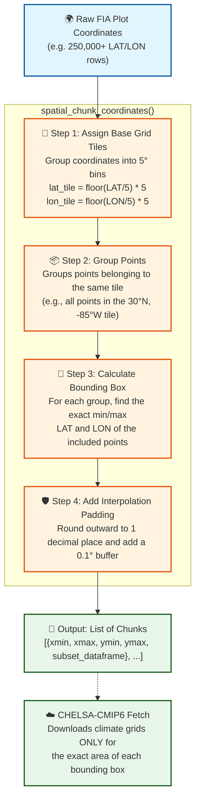

# Training the MATRIX Model

This directory handles the data preparation and training pipelines for the Matrix Model's global forest demography Random Forests. 

## Training Data Requirements

To successfully train the demographic components (Upgrowth, Mortality, and Recruitment), your dataset must meet the following structural and environmental requirements:

### 1. Plot-Level Longitudinal Data
The model relies on repeat measurements of individual trees over time.
- **`PrevYR` & `YR` (or `dY`):** The initial and subsequent measurement years to calculate the time interval between surveys.
- **`PrevDBH` & `DBH`:** The diameter at breast height (in cm) of the tree at both time periods.
- **`Status` / `M`:** A flag indicating whether the tree died between measurements.
- **`TPH` (Trees Per Hectare):** The expansion factor or weight of the sampled tree to calculate stand-level metrics like basal area (`B`) and density (`N`).
- **`R` (Recruitment):** New trees that grew past the minimum DBH threshold (e.g., 10 cm) between measurements must be identifiable.

### 2. Spatial Cross-matching
Every plot must have accurate **Latitude** and **Longitude** (`LAT` / `LON`) coordinates to intersect with global gridded spatial covariates. 

### 3. Required Covariates
The Random Forest models predict demography using approximately 40 environmental drivers. The pipeline extracts these using spatial data, but if you provide a pre-processed dataset, it must contain:
- **Bioclimate (`C1`-`C21`):** 19 standard BioClim variables, plus Annual Aridity Index (AI) and Potential Evapotranspiration (PET).
- **Soil Properties (`O1`-`O5`):** Bulk density, Total Nitrogen, C/N ratio, pH in water, and Electrical conductivity.
- **Anthropogenic Impacts (`H1`-`H4`):** Human footprint (current and historical changes), roadless area proximity, and protected area status.
- **Topography (`T1`-`T12`):** Slope, aspect, curvature, Topographic Position Index (TPI), and terrain roughness.
- **Ecoregions (`GEZ` & `CONTINENT`):** Global Ecological Zones and Continent labels to one-hot encode regional fixed effects.

### Warnings & Edge Cases
- **Missing Covariates:** The training pipeline uses a spatial nearest-neighbor algorithm (`replace_rows_with_nearest`) to impute missing environmental data.
- **Short Time Intervals:** Measurement intervals (`dY`) that are too short (1-2 years) may hide true diameter increment (`dD`) behind measurement error, reducing Upgrowth $R^2$.
- **Class Imbalance:** Mortality is a rare event. Heavy disturbance tracking requires careful stratification.

---
*For the data preparation script, see `prepare_data.py`.*

## Soil Covariates Extraction Pipeline

To populate the `O1`-`O5` soil properties for our training coordinates, we use a hybrid extraction approach defined in `soil_covariates.py` and orchestrated by `covariates.py`.

### Implementation Details
*   **Physical Properties (O1, O4, O5):** Extracted from the **USDA SSURGO** database using the [Soil Data Access (SDA) REST API](https://sdmdataaccess.nrcs.usda.gov/). We use the `SDA_Get_Mukey_from_intersection_with_WktWgs84` stored procedure to spatially join coordinate points to the seamless physical ground surveys, processing concurrently using Python's `ThreadPoolExecutor`.
*   **Chemical Properties (O2, O3):** Extracted from [SoilGrids 2.0](https://soilgrids.org/) via the [Google Earth Engine Python API](https://developers.google.com/earth-engine/guides/python_install). To ensure stability and speed, we massively parallelize extraction by converting coordinates to an `ee.FeatureCollection` and utilizing Earth Engine's native `reduceRegions` batch processing on the Google backend. 

### How to Run and Validate
The pipeline CLI (located in `test_soil_covariates.py`) is designed to iteratively test and validate before executing massive extractions:
1.  **Validate End-to-End Locally:** 
    ```bash
    uv run python3 Training/test_soil_covariates.py --test-merge --limit 3
    ```
    *This hits both the SSURGO and Earth Engine APIs for 3 rows and prints the merged Pandas DataFrame.*

2.  **Run Full Pipeline & Upload:**
    ```bash
    nohup uv run python3 Training/test_soil_covariates.py --test-upload > covariates_upload.log 2>&1 &
    ```
    *This processes all hundreds of thousands of coordinates without limits and uploads the merged dataset to BigQuery (`fia_matrix_training_cov_soil`).*

### How to Monitor
Because the full USDA SDA extraction can take upwards of 14 hours due to strict REST API throttling (processing ~5 points per second safely), the full pipeline is executed as a background job.

You can monitor the real-time extraction progress by tailing the log file:
```bash
tail -f Training/covariates_upload.log
```
If you ever need to stop the background extractor, grab the PID (which you can store in a `.pid` file or find via `ps aux`) and issue a kill command.

## Climate Covariates Extraction Pipeline

To populate time-varying temperature and precipitation variables (e.g., `tas`, `pr`, and bioclimatic variables `bio1`-`bio19`) for our training coordinates, we use the logic inside `climate_covariates.py`.

### Implementation Details
*   **Data Source & Downscaling:** We utilize the [chelsa-cmip6](https://github.com/KargerLab/chelsa-cmip6) Python package. This tool downscales [CMIP6](https://wcrp-cmip.org/cmip-phase-6-cmip6/) climate projections to a high resolution (30 arc-seconds, ~1km) using the delta change method over [CHELSA V2.1](https://chelsa-climate.org/) observational baselines.
*   **Remote Storage Access:** The data is accessed from [Pangeo Zarr storage](https://pangeo.io/data.html) via lazy-loading, meaning only the requested geographical bounds are processed over the network.
*   **Coordinate Point Extraction:** After the `chelsa-cmip6` script successfully downloads the NetCDF grids for a specific bounding box, we use `xarray` nearest-neighbor indexing (`.sel(lat, lon, method="nearest")`) to slice exactly the required LAT/LON points dynamically out of those grids.
*   **Customizable Scenarios:** The extraction loop natively supports historical periods and expands seamlessly across future SSPs (e.g., `ssp245`, `ssp585`).

### Spatial Chunking
Because our FIA plots spread across the entirety of North America, requesting a single bounding box bounding the absolute minimum and maximum coordinates would force `chelsa-cmip6` to download data spanning from the Pacific Ocean to the Atlantic Ocean. Doing this across 19+ bioclim variables and 80+ years would cause severe memory, local storage, and request limits.

To solve this, we implemented **spatial chunking**:

This isolates the heavy remote queries purely to where forest plots actually exist and batches requests in secure 5-degree increments.

### How to Run and Validate
The local testing CLI inside `test_climate_covariates.py` evaluates extraction progressively without executing everything at once:
1.  **Validate Bounding Box Space:**
    ```bash
    uv run python3 Training/test_climate_covariates.py --test-climate-bq --limit 1000
    ```
2.  **Validate NetCDF Extraction Locally:**
    ```bash
    uv run python3 Training/test_climate_covariates.py --test-climate-extract --limit 20
    ```
    *Note: Generating the initial `chelsa-cmip6` grid files will take **minutes to hours** strictly because downloading heavy CMIP variables over Zarr is heavily bottlenecked by remote servers.*

### How to Monitor
Because this query mechanism is extremely slow on large batches of plots, you should deploy the full system extraction (`--test-climate-extract`, or an overarching execution script) as a background process:
```bash
nohup uv run python3 Training/test_climate_covariates.py --test-climate-extract > climate_extraction.log 2>&1 &
```
You can monitor which NetCDF array variable it is downloading/extracting point data for by monitoring the log tail:
```bash
tail -f Training/climate_extraction.log
```
